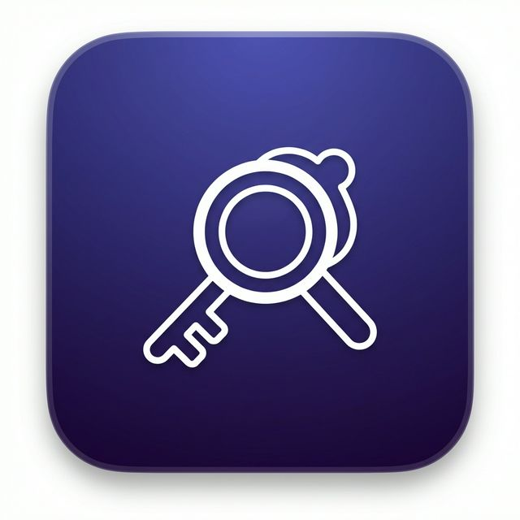

<p align="center">
  
</p>

<h1 align="center">Bitty</h1>

<p align="center">
  <strong>Quick Bitwarden vault search from your menu bar.</strong>
  <br>
  A lightweight macOS menu bar app that lets you instantly search, browse, and copy credentials from your Bitwarden vault — without ever leaving what you're doing.
</p>

<p align="center">
  <a href="#installation">Installation</a> •
  <a href="#features">Features</a> •
  <a href="#keyboard-shortcuts">Keyboard Shortcuts</a> •
  <a href="#prerequisites">Prerequisites</a> •
  <a href="#development">Development</a> •
  <a href="#security">Security</a> •
  <a href="#contributing">Contributing</a> •
  <a href="#license">License</a>
</p>

---

## Features

- ⚡ **Instant search** — Fuzzy search across names, usernames, and URLs
- ⌨️ **Global hotkey** — Toggle Bitty from anywhere with `Ctrl + Space`
- 📋 **One-key copy** — Copy usernames, passwords, URIs, or notes with a single keystroke
- 🔒 **Auto-lock** — Vault automatically locks after 5 minutes of inactivity
- 🧹 **Clipboard clearing** — Copied secrets are wiped from your clipboard after 30 seconds
- 🔐 **2FA support** — Full two-factor authentication flow during login
- 🔑 **Password generator** — Generate strong passwords with configurable options
- ➕ **Quick add** — Create new vault entries without leaving the app
- 🔄 **Vault sync** — Sync your vault on demand from the tray menu
- 🚀 **Launch at login** — Optionally start Bitty when you log in
- 🪟 **Native feel** — Frameless, transparent window with macOS vibrancy

## Prerequisites

Bitty requires the **Bitwarden CLI** (`bw`) to be installed on your system.

### Install the Bitwarden CLI

```bash
# Using Homebrew (recommended)
brew install bitwarden-cli

# Or download directly from
# https://bitwarden.com/help/cli/#download-and-install
```

Make sure the CLI is available at `/opt/homebrew/bin/bw`. If you installed it elsewhere, update the `BW_PATH` constant in `src/bitwarden.js`.

> [!NOTE]
> You must have an existing Bitwarden account. Bitty authenticates through the official Bitwarden CLI — your master password is never stored by Bitty.

## Installation

### Download a release

Download the latest `.dmg` from the [Releases](https://github.com/SERFF/bitty/releases) page, open it, and drag Bitty to your Applications folder.

### Build from source

```bash
# Clone the repository
git clone https://github.com/SERFF/bitty.git
cd bitty

# Install dependencies
npm install

# Run in development mode
npm start

# Build the macOS .dmg
npm run build
```

## Usage

1. **Launch Bitty** — the app icon appears in your menu bar
2. **Press `Ctrl + Space`** to open the search window
3. **Type to search** your vault entries
4. **Navigate** with arrow keys and press `Enter` to copy the password
5. **Press `→`** to view item details, `←` to go back
6. The window auto-dismisses after copying, and focus returns to your previous app

### Authentication

On first launch (or after your session expires), Bitty will prompt you to log in:

| Status | What to do |
|---|---|
| **Unauthenticated** | Enter your email and master password |
| **Locked** | Enter your master password to unlock |
| **2FA required** | Enter your verification code when prompted |

## Keyboard Shortcuts

### Global

| Shortcut | Action |
|---|---|
| `Ctrl + Space` | Toggle Bitty window |

### Search View

| Shortcut | Action |
|---|---|
| `↑` `↓` | Navigate results |
| `→` | View item details |
| `←` | Back to list |
| `Enter` | Copy password |
| `Ctrl + N` | Create new login |
| `Esc` | Close window |

### Detail View

| Shortcut | Action |
|---|---|
| `U` | Copy username |
| `P` | Copy password |
| `L` | Copy URL |
| `O` | Copy notes |
| `←` | Back to list |
| `Esc` | Close window |

### New Login View

| Shortcut | Action |
|---|---|
| `Ctrl + S` | Save item |
| `Ctrl + G` | Generate password |
| `Tab` | Next field |
| `Esc` | Cancel |

### Tray Menu

Right-click the menu bar icon for additional options:

- **Show** — Open the search window
- **Sync Vault** — Pull latest changes from Bitwarden
- **Launch at Login** — Toggle auto-start
- **Lock Vault** — Immediately lock the vault
- **Quit** — Exit Bitty

## Security

Bitty is designed with security in mind:

- **No credential storage** — Bitty never persists your master password or session key to disk. Everything is held in memory only.
- **Auto-lock** — The vault locks automatically after 5 minutes of inactivity.
- **Clipboard clearing** — Copied credentials are automatically cleared from the clipboard after 30 seconds.
- **Context isolation** — The renderer process runs with `contextIsolation: true` and `nodeIntegration: false`, communicating with the main process only through a restricted IPC bridge.
- **Content Security Policy** — Strict CSP prevents loading of external scripts, styles, or images.
- **Input validation** — All IPC handlers validate input types and restrict copy fields to an explicit allowlist.
- **Official CLI** — All vault operations go through the official Bitwarden CLI, so you benefit from Bitwarden's own encryption and security model.

## Tech Stack

| Layer | Technology |
|---|---|
| Framework | [Electron](https://www.electronjs.org/) |
| Vault Backend | [Bitwarden CLI](https://bitwarden.com/help/cli/) |
| Auto Launch | [auto-launch](https://github.com/Teamwork/node-auto-launch) |
| Build | [electron-builder](https://www.electron.build/) |

## Project Structure

```
bitty/
├── assets/
│   ├── icon.icns            # macOS app icon
│   ├── icon.png             # Source icon
│   ├── iconTemplate.png     # Menu bar tray icon
│   └── iconTemplate@2x.png # Menu bar tray icon (Retina)
├── src/
│   ├── main.js              # Electron main process
│   ├── bitwarden.js         # Bitwarden CLI wrapper
│   ├── preload.js           # Context bridge (IPC API)
│   ├── settings.js          # Persistent settings with schema validation
│   ├── vaultCache.js        # Encrypted vault cache (AES-256-GCM)
│   └── renderer/
│       ├── index.html       # App markup
│       ├── styles.css       # Styling
│       └── app.js           # Renderer logic
├── tests/
│   ├── bitwarden.test.mjs   # Bitwarden module tests
│   ├── settings.test.mjs    # Settings validation tests
│   └── vaultCache.test.mjs  # Vault cache encryption tests
├── vitest.config.mjs
├── package.json
└── README.md
```

## Development

### Running locally

```bash
npm install
npm start
```

The app will launch and appear in your menu bar. Press `Ctrl + Space` to open the search window.

### Building for distribution

```bash
npm run build
```

This creates a `.dmg` file in the `dist/` directory.

### Customizing the Bitwarden CLI path

If `bw` is not installed at `/opt/homebrew/bin/bw`, update the `BW_PATH` constant at the top of `src/bitwarden.js`:

```javascript
const BW_PATH = '/your/custom/path/to/bw';
```

## Contributing

Contributions are welcome! Here's how to get started:

1. **Fork** the repository
2. **Create a branch** for your feature or fix:
   ```bash
   git checkout -b feature/my-awesome-feature
   ```
3. **Make your changes** and test them locally with `npm start`
4. **Commit** with a clear, descriptive message
5. **Open a Pull Request** against `main`

### Ideas for contributions

- Windows / Linux support
- TOTP (authenticator) code display
- Folder-based browsing
- Configurable auto-lock timeout
- Configurable global hotkey
- Browser extension integration

## License

This project is licensed under the **MIT License** — see the [LICENSE](LICENSE) file for details.

---

<p align="center">
  Made with ❤️ by <a href="https://serff-webdevelopment.nl">Serff Webdevelopment</a>
</p>
